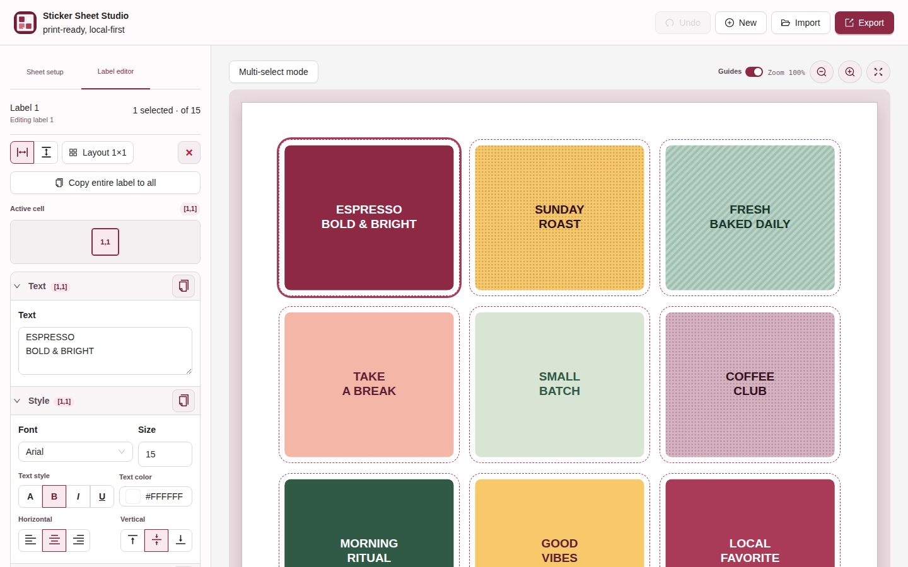
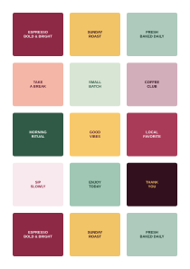

# Sticker Sheet Studio

A local-first browser app for designing printable, pre-cut sticker sheets. Configure a page, lay out a grid of labels, customize each sticker, and export a print-ready SVG or PDF.

**Live site:** [vejha.github.io/sticker-sheet-studio](https://vejha.github.io/sticker-sheet-studio/)

## Screenshots

<table>
   <tr>
      <td width="50%" align="center">
         <strong>Design in the browser</strong><br>
         <sub>Current editor with content-grid controls and a spaced sheet preview.</sub><br><br>
         
      </td>
      <td width="50%" align="center">
         <strong>Actual print output</strong><br>
         <sub>Real exported SVG with spaced, colorful labels and no preview guides.</sub><br><br>
         
      </td>
   </tr>
</table>

## What it can do

- Configure **A4** or **Letter** sheets in portrait or landscape orientation.
- Set independent page margins, label dimensions, and a shared cutout corner radius.
- Automatically calculate the number of labels that fit on the page.
- Edit one or more labels at once:
   - split a label into a `1 × 1` through `3 × 3` content grid with adjustable row and column proportions;
   - edit each grid cell's text, font, size, mutually exclusive regular/bold/italic/underline style, alignment, and flow direction;
   - solid color, patterned, or image backgrounds;
   - optional solid, dashed, or dotted printable border with custom color and physical width;
   - image crop position and zoom;
   - print-safe inset and rounded artwork clipping.
- Copy text/style by matching row and column; labels without that coordinate are skipped.
- Copy a layout to all labels while preserving each label's content at overlapping coordinates.
- Save templates locally in the browser and import/export template JSON.
- Preview a sheet with a transparency checkerboard, selection state, and zoom controls.
- Undo up to five recent editing transactions during the current browser session with the header button or `Ctrl/Cmd+Z`.
- Open a clean **Print preview** in the Export dialog.
- Export print-ready **SVG** and **PDF** files, or use the browser print dialog.

All editing and image processing occur in the browser. No account, upload service, or server-side storage is required.

## Example workflow

1. Open **Sheet setup** and choose the page format, orientation, margins, and label size.
2. Select a sticker in the preview, then open **Label editor**.
3. Choose a content grid, select a cell, then enter text and use the font, alignment, and content-flow controls.
4. Choose a background type:
   - **Solid** for a single color;
   - **Pattern** for dots or stripes;
   - **Image** to upload, drag, and zoom a background image.
5. Adjust the print-safe border if artwork should not run to the cut edge.
6. Open **Export** to inspect the clean white print preview, then download SVG/PDF or select Print.

### Output examples

- **SVG** — ideal for vector workflows, cutter software, and further design edits.
- **PDF** — a print-ready sheet at the configured page size.
- **Template JSON** — save a reusable sheet setup and label design locally or share it as a file.

### Template compatibility

Template JSON includes an explicit schema version. Exports always use the current version and include sheet geometry, content grids and proportions, per-cell text styles, appearance images/crops, and printable borders. Older templates are migrated during import. Templates created by a newer unsupported app version are rejected with a specific compatibility message instead of being silently downgraded.

## Run locally

Requires a current Node.js LTS release.

See [CHANGELOG.md](CHANGELOG.md) for release notes.

```bash
npm install
npm run dev
```

Run the model tests:

```bash
npm test
```

Create a production build and inspect it locally:

```bash
npm run build
npm run preview
```

## Deploy to GitHub Pages

The included workflow deploys every push to `main`.

1. In the repository, open **Settings → Pages**.
2. Set the source to **GitHub Actions**.
3. Push to `main`.
4. The site will be published at:

   `https://vejha.github.io/sticker-sheet-studio/`

The workflow builds with `VITE_BASE_PATH=/sticker-sheet-studio/`, so static assets work correctly on a GitHub Pages project site.

## Project structure

- `src/main.js` — React/Ant Design app and browser interactions.
- `src/model.js` — page, label, crop, SVG, and PDF geometry.
- `src/style.css` — responsive app, editor, preview, and print styling.
- `test/model.test.js` — model and export geometry tests.
- `.github/workflows/pages.yml` — GitHub Pages build and deployment workflow.

## License

MIT
